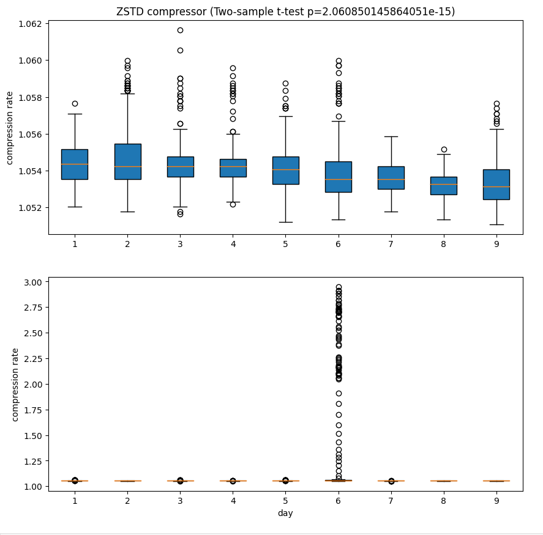
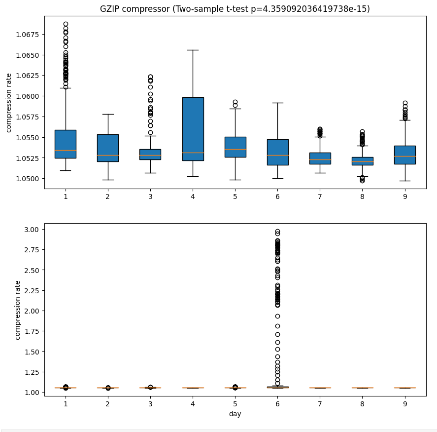

## Lossless Compression on Human Epileptic Intracortical Array Data

This dataset includes intracortical spike data collected from human epilepsy patients. The data was collected over several hours while the patient was in a care setting. All private data has been removed. During this collection period, subjects experienced seizures. These events are separately labeled in the dataset metadata.

In this session, we use lossless compressors like zstd and gzip on the dataset to test if the compression rate is a good indicator of epileptic seizure.

The upper plot shows the compression rate of the zstd compressor on 5-minute windows during seizure onset. The boxplots show the medians and quartiles. The two-sample t-test between seizures and randomly selected 5-minute windows from the data suggests that the compression rates have significant changes during seizure, with low p-values, which indicates that the compression rate can be used to measure epileptic seizure. 

Similar to the above plot, the upper plot shows the compression rate of the gzip compressor on 5-minute windows during seizure onset. The result is pretty much the same as the result of the zstd compressor. The reason might be that both of the gzip algorithm and the zstd algorithm are based on the LZ77 algorithm and Huffman coding.

In the next step, we will try to apply lossy compressors on the data.