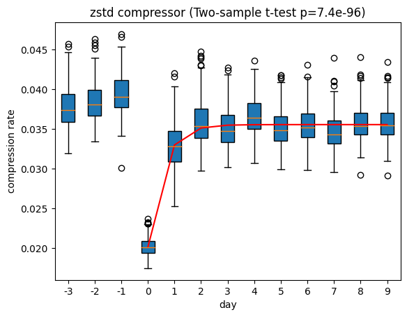
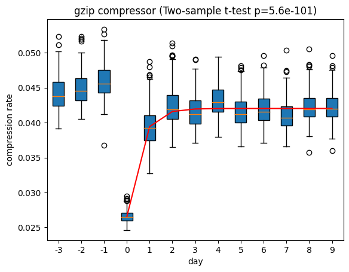

## Loseless Compression on NHP Intracortical Array Data

This dataset includes the intracortical spike data collected from the motor cortex of a male rhesus macaque by a 96-electrode Utah array. The data was collected during a stereotyped reaching task in 13 consecutive days (3 pre-lesion days -3, -2, and -1; 10 post-lesion days from day 0 to day 9). On day 0, small electrolytic lesions were performed through the array in the motor cortex. 

In this session, we perform loseless compressors like zstd and gzip on the dataset to test if the compression rate is a good indicator of the brain lesion.

The upper plot shows the compression rate of the zstd compressor on trials across different days. The bosplots show the medians and quartiles. The two-sample t-test between pre-lesion daysand post-lesion days suggests that the compression rates have significant changes after lesion (p=7.4e-96), which indicates that the compression rate can be used to measure brain damages. Moreover, the red line shows the regression between post-lesion compression rates and recovery days (the regression is performed using exponential functions), which suggests that the compression rates can also indicate the restoration of the brain function.

The upper plot shows the compression rate of the gzip compressor on trials across different days. The result is pretty much the same as the result of the zstd compressor. The reason might be that both of the gzip algorithm and the zstd algorithm are based on the LZ77 algorithm and the Huffman coding.

In the next step, we will try to apply lossy compressors on the data. We will also try to test the compressor on a different modality of data, such as calcium imaging data.